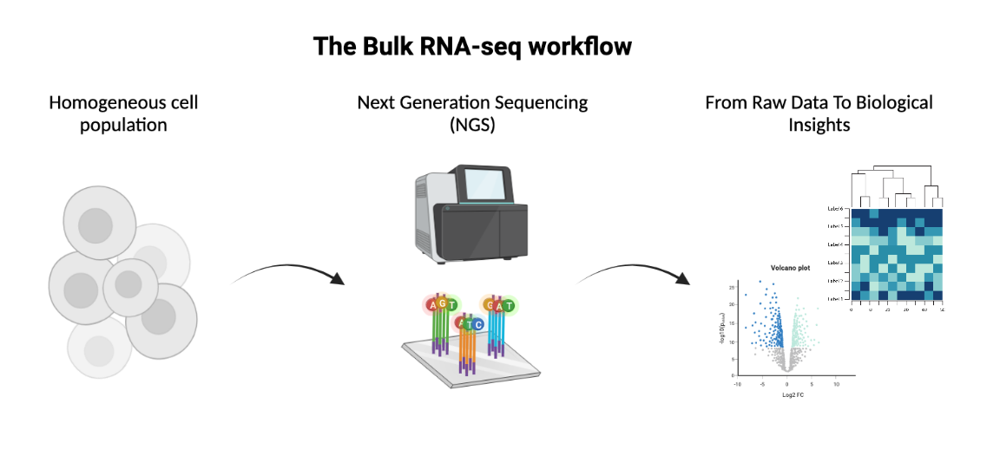

# MOBW2026
### Molecular Oncology Bioinformatics Workshop

Materials for the Bioinformatics Workshop in the Molecular Oncology course of the Medical Biotechnology and Molecular Medicine Master degree from University of Milan. The Workshop is articulated in three days and follows a standard RNA-seq **downstream data analysis workflow in `R`**, with a theoretical introduction to pre-processing steps. The total training time is around 16 hrs.

### Software requirements
The site was developed using R 4.5.3 and Quarto 1.9.36. All software required for the analysis is available for installation by running the `installations.R` script.
