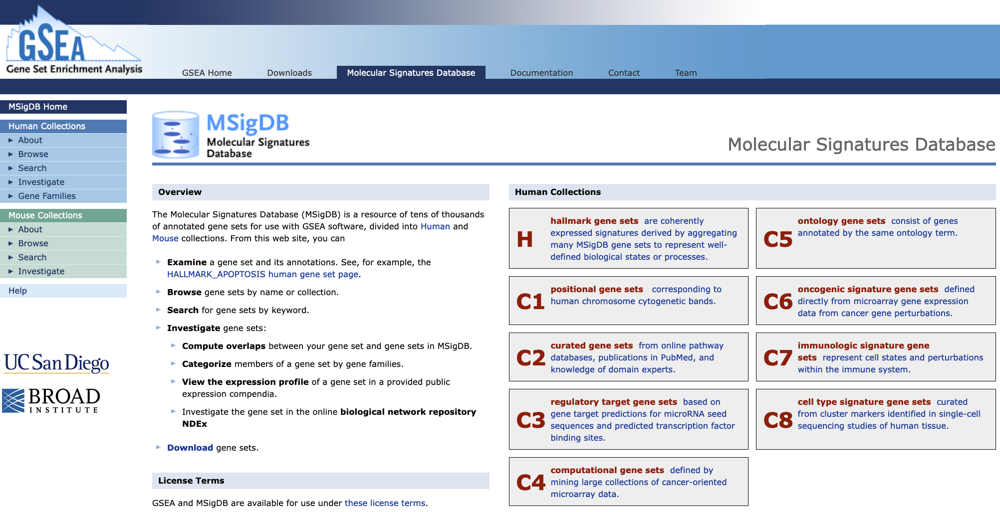

```{r setup, include=FALSE}
knitr::opts_chunk$set(echo = TRUE, fig.align = 'center', warning = FALSE, message = FALSE)
```

```{r, include=FALSE}
library(kableExtra)
library(tidyr)
library(dplyr)
library(edgeR)
library(pheatmap)
library(ggplot2)
library(org.Hs.eg.db)
library(SummarizedExperiment)
library(BioNERO)

set.seed(28) # for reproducibility

# Load the data again
dds <- readRDS("../data/dds_object.rds")

samples <- read.csv("../data/samples_info.csv")
rownames(samples) <- samples$X
samples <- samples[,c("Donor","SampleGroup","sex")]

# Re-create design
donor <- samples$Donor
sample_group <- factor(samples$SampleGroup, levels=c("Teff","Trest","Ttumor","Tex")) # Teff becomes our "control" group to which we compare the others

design <- model.matrix(~ donor + sample_group)

res <-read.table("../data/results.csv", sep=",")

up_df <- res %>% as.data.frame() %>% filter(PValue < 0.05 & logFC > 1)
down_df <- res %>% as.data.frame() %>% filter(PValue < 0.05 & logFC < -1)


```

## Objectives
- _Learn about further downstream analyses of bulk RNA-seq data_
- _Explore Gene Set Enrichment Analysis (GSEA)_
- _Perform GSEA on gene sets of interest_
- _Check unsupervised Gene Ontologies (GO) on differentially-expressed genes_
- _Visualize GO Enrichment results_
- _Learn about gene-gene relationships and build a full Gene Regulatory Network (GRN)_

## Further Downstream Analyses

Once we have our differentially expressed genes, we can **perform various downstream analyses to check the functional aspects of the group of genes which are up- or down-regulated** in our condition of interest.
In the following sections, we will go through two of these, **Gene Set Enrichment Analysis** (GSEA) and **Gene Ontology Enrichment Analysis** (GO).

### GSEA

Gene Set Enrichment Analaysis was [first published](https://www.pnas.org/doi/10.1073/pnas.0506580102) in 2005 as a **method to interpret genome-wide expression profiles from RNA-seq data using sets of genes with known biological functions**.
In this sense, GSEA is used to **check at which level a signature of genes is *enriched* in an expression profile**.
We can graphically summarize the steps in GSEA using the following picture, from the original publication.

<center>


_GSEA needs two ingredients, a **ranked** gene list from our analysis (for instance genes ordered by log-fold change) and a list of genes with biological relevance (for instance genes known to regulate CD8+ T-cell exhaustion)._

</center>

**1.**  We start by taking our  **genes** from our `res` data table and **order (rank) them based on the value of their _fold-change_** so that strongly up-regulated genes will be at the top of our list and strongly down-regulated genes at the bottom.
    This will represent our **ranking**.

**2.**  We then **take one or more curated and archived _gene sets_ which are related to a biological function** we might be interested in investigating in our dataset.

**3.**  Finally we **go through our ranking** from top to bottom **counting the number of times we see a gene which is also in the _gene set_ that we are looking at**. Each time we encounter a gene in the geneset of our interest we increase the _running score_ (ES) whereas if the gene is not present in the geneset, we decrease the score.
    We expect to see genes from a given **gene set** appear at the top of our ranking if that biological function is particularly important in the genes of our ranking.

Over the years, a collection of curated gene sets called **[MSigDB](https://www.gsea-msigdb.org/gsea/msigdb/)** has been expanded and is now a **great resource** to check which ones are more or less enriched in our data at hand.

<center>



_The web interface for the MSigDB gene set database_

</center>

In our specific use case, **we are going to run GSEA on the set of genes in CD8+ T~ex~ cells to check if a gene set of exhaustion is indeed enriched in the genes we have found up-regulated**.
For this task we are going to use the `fgsea` package.
In order to extract the gene set without the need to directly download it, we are going to **access MSigDB directly from `R`** using another package called `msigdbr`.

> 🚨
> **WARNING**: This code that follows might kill your `R` session inadvertedly. If this happens, don't panic, and reload the object we saved before! Use the following syntax to get back on track after you resume the session:
>```r
>  res <- read.table("results.csv", sep = ",")
>  samples <- read.table("samples_table.csv", sep = ",")
>```
> In this way you should be all set to successfully run all the code below! 🙌🏻 

#### Extract MSigDB Signatures
In the following chunk, we use a function from the `msigdbr` package to extract the gene set of our interest:

```{r}
library(msigdbr)

# Extract the gene sets from the MSigDB database
immune_gsets <- msigdbr(species = "human", category = "C7", subcategory = "IMMUNESIGDB")
```

Let's see what's in the `immune_gsets` object:

```{r, eval=FALSE}
# Take a look at what we fetched from the database
head(immune_gsets, 5)
```

```{r, echo=FALSE}
# Take a look at what we fetched from the database
head(immune_gsets, 3) %>% kbl() %>% kable_styling()
```

We can see that every row is a different gene (the `gene_symbol` colums) with its associated gene set (`gs_name` column).
We will now extract a gene set related to CD8+ T-cell exhaustion which comes from [this publication](https://www.sciencedirect.com/science/article/pii/S1074761307004542?via%3Dihub) and is names [`GSE9650_EFFECTOR_VS_EXHAUSTED_CD8_TCELL_DN`](https://www.gsea-msigdb.org/gsea/msigdb/human/geneset/GSE9650_EFFECTOR_VS_EXHAUSTED_CD8_TCELL_DN.html) in the database.

```{r}
# Filter the `immune_gsets` table and take only the genes from the gene set of our interest
gene_set_name <- "GSE9650_EFFECTOR_VS_EXHAUSTED_CD8_TCELL_DN"
tex_sig_df <- immune_gsets %>% filter(gs_name == gene_set_name)
```

How many genes do we have in the gene set that we just isolated?
We can check this by looking at the number of rows of this new `tex_sig_df` table that we generated above using the command `nrow(tex_sig_df)`.
Doing this should result in having `r nrow(tex_sig_df)` genes.

#### Perform GSEA
Now we can perform GSEA using the `fgsea` package in `R`!

```{r}
library(fgsea)

# Prepare the ranking based on fold-change, from high (expressed in Tex) to low (expressed in Teff)
ids <- res %>% arrange(desc(logFC)) %>% rownames()
vals <- res %>% arrange(desc(logFC)) %>% pull(logFC)

# Set names
names(vals) <- ids 

# Prepare gene set
gset <- list(tex_sig_df$ensembl_gene)
names(gset) <- gene_set_name

# Run GSEA
fgseaRes <- fgsea(pathways = gset, 
                  stats    = vals,
                  eps      = 0.0)

```

```{r, eval=FALSE}
# Take a look at results
fgseaRes
```

```{r, echo=FALSE}
# Take a look at results
as.data.frame(fgseaRes) %>% kbl() %>% kable_styling()
```

We can now **plot the GSEA results** in the standard way:

```{r}
# Plot GSEA results
plotEnrichment(gset[[gene_set_name]],
               vals) + labs(title=gene_set_name)

```

From the GSEA results, we can see that **the current gene set we used is mostly depleted in the differential genes we have in our CD8+ T~ex~ vs CD8+ T~eff~ comparison**.
Given that the gene set comes from a study carried out in mice in a context of chronic viral infection, this might indicate that our current results reflect a different kind of CD8+ T-cell exhaustion observed in the tumor microenvironment of human tumors as opposed to the process happening during viral infection in mice.

> 💡
> **Whenever we use gene sets when testing for enrichment, we have to be sure of _where_ they were isolated in order to avoid misinterpreting results and/or getting to wrong conclusions, like it could have happened in this case!**

### Gene Ontology Enrichment Analysis

Next, we will try to **get a more _unsupervised_ look at what kind of biology is happening inside our CD8+ T~ex~ cells by performing a Gene Ontology Enrichment analysis**.
This will allow us to check which and how many up-regulated genes in CD8+ T~ex~ cells are represented in various biological processes.
We will do this using the `clusterProfiler` package in `R`.


```{r}
up_df <- res %>% as.data.frame() %>% filter(PValue < 0.05 & logFC > 1)
down_df <- res %>% as.data.frame() %>% filter(PValue < 0.05 & logFC < -1)
```

```{r}
library(clusterProfiler)

# Get up-regulated genes
genes <- rownames(up_df)

# Perform gene ontology enrichment
ego <- enrichGO(gene         = genes,
                OrgDb         = org.Hs.eg.db,
                keyType       = 'ENSEMBL',
                ont           = "MF", # Molecular Function, use "BP" or "CC" for Biological Process or Cellular Component
                pAdjustMethod = "BH",
                pvalueCutoff  = 0.05,
                qvalueCutoff  = 0.05,
                readable      = TRUE)

```

```{r, eval=FALSE}
head(ego)
```

```{r, echo=FALSE}
head(ego) %>% kbl() %>% kable_styling()
```

Let's now plot the enrichment values that we got with a _graph layout_.

```{r}
# Plot results of gene ontology enrichment
goplot(ego, firstSigNodes=10)
```

Now we can also plot the results with what is known as a ranked **dot plot**, here we **encode the significance of the enrichment in the color of the dot**, while its size represent the overlap of the specific gene set with the one we are using to perform the test (our list of up-regulated genes).

```{r}
dotplot(ego, showCategory=15) + ggtitle("Dotplot for GO enrichment")
```

> 💡
> **GO analyses might highlight very interesting patterns and generate hypotheses, but are many times quite hard to interpret depending also on the biological system we are studying.**

### Gene Regulatory Network inference
In this part of the workshop, we will use [`ARACNE`](https://link.springer.com/article/10.1186/1471-2105-7-S1-S7) to infer relationships between genes in our data! This is informative since it allows us to group together genes based on correlations across samples. in other words we try to create gene groups (or "hubs" in network analytics terminology) based on how coordinately genes are expressed in the data.
The way this works is that we _infer_ which transcription factors might be linked to the regulation of specific genes by analyzing how much each pair of genes is co-dependent. This is of course a simplification of the approach but you can think of the results as a collection of pair-wise gene-gene connections called "_directed edges_" described by a single "_weight_" representing the strength of the regulation.

```{r}
# Create a SummarizedExperiment from `dds`, think of this as another way to store the same information we used before!
# Like we did before, we convert gene IDs to more interpretable symbols
se <- SummarizedExperiment(
    assays = list(
        counts = dds$counts,                        
        norm.factors = matrix(                      
            dds$samples$norm.factors,
            nrow = nrow(dds$counts),
            ncol = ncol(dds$counts),
            byrow = TRUE,
            dimnames = dimnames(dds$counts)
        )
    ),
    colData = dds$samples,                        # sample metadata
    rowData = dds$genes                           # gene metadata (if present)
)

# We use it as input to aracne through BioNERO
# Step 1: filter samples
final_exp <- exp_preprocess(
    se, 
    min_exp = 10, 
    variance_filter = TRUE, 
    n = 2000
)
```

The second ingredient we need is a list of potential regulators, we will therefore load a set of human transcription factors (TFs) that we can download from a [database curated by the University of Toronto](https://humantfs.ccbr.utoronto.ca/download.php).

> 💡 Download the "TF ensembl IDs" `.txt` file from the provided link and save it in your `data` folder! 

```{r, echo=FALSE}
tf_symbols <- read.table("../data/TFs_Ensembl_v_1.01.txt", header = F)
```

```{r, eval=FALSE}
# Load the TFs!
tf_symbols <- read.table("./data/TFs_Ensembl_v_1.01.txt", header = F)
```

After we have performed the correct filtering to ensure consistency, we can now apply `ARACNE`!

```{r}
# Step 2: use ARACNE
aracne_obj <- grn_infer(
    final_exp, 
    method = "aracne", 
    regulators = tf_symbols$V1, 
    nTrees = 10) # Usually set to 1,000 - improves accuracy

```

Now let's see what our gene regulatory network looks like!

```{r}
# Show a snapshot of the gene regulatory network
head(aracne_obj)
```

We can exchange Ensembl gene IDs with gene names like we did for the volcano plot above to aid with interpretability. The `Node1` column should contain transcription factor names that represent our putative regulators!

```{r}
# Convert source nodes (TFs)
aracne_obj$Node1 <- mapIds(org.Hs.eg.db, keys=aracne_obj$Node1, column="SYMBOL", keytype="ENSEMBL", multiVals="first")

# Convert targets (inferred genes regulated by TFs)
aracne_obj$Node2 <- mapIds(org.Hs.eg.db, keys=aracne_obj$Node2, column="SYMBOL", keytype="ENSEMBL", multiVals="first")

# Filter unmapped symbols
aracne_obj <- aracne_obj %>% na.omit()

# Show example
head(aracne_obj)
```

Let's plot it to explore the results!

```{r}
# Easy convenience function from BioNERO
plot_grn(aracne_obj)
```

> 💡 Although this visualization is nice to get a global overview, try to re-use the same function above but with `interactive = TRUE` and see what happens

<details>
<summary>Show result</summary>

```{r, echo=FALSE}
# Easy convenience function from BioNERO
plot_grn(aracne_obj, interactive = TRUE)
```

</details>

> 🤔 How would you go about intepreting this network in light of the fact that we have different experimental conditions and samples? Can you think of a way to integrate visually the information of the different CD8+ T cells subsets we have in the data?

# Recap
Let's go through what we have seen today:

- Learned about Differential Expression Analysis and what it is used for
- We performed the analysis on our CD8+ T cell dataset
- Managed to extract differentially-expressed genes
- Visualized the results in different ways, with each having its own strengths and weaknesses
- Interpreted the results with the help of downstream analysis including GSEA and Gene Ontology (GO)
- Created a gene-regulatory network (GRN) and used graphs to display them

# Take-home Messages 🏠
Congratulations! You got the end of the course and now hopefully **know the main steps of a bulk RNA-seq data analysis workflow**!
Some of the _key concepts_ that we have explored during the course can enable us to reach some distilled points of interest:

- **Design your experiments carefully** with data analysis in mind!

- **Data needs to be carefully explored** to avoid systematic errors in the analyses!

- **Plot and Visualize** as much as possible!

- Not all information is useful, remember that **it all depends on the biological question**!

- Omics outputs are immensely rich and **one experiment can be used to answer a plethora of questions**!

<center>

**And also remember that your computer is always right!**

<div class="tenor-gif-embed" data-postid="15542044" data-share-method="host" data-aspect-ratio="1.44796" data-width="60%"><a href="https://tenor.com/view/thumbs-up-nod-okay-gif-15542044">Thumbs Up Nod GIF</a>from <a href="https://tenor.com/search/thumbs+up-gifs">Thumbs Up GIFs</a></div> <script type="text/javascript" async src="https://tenor.com/embed.js"></script>

</center>